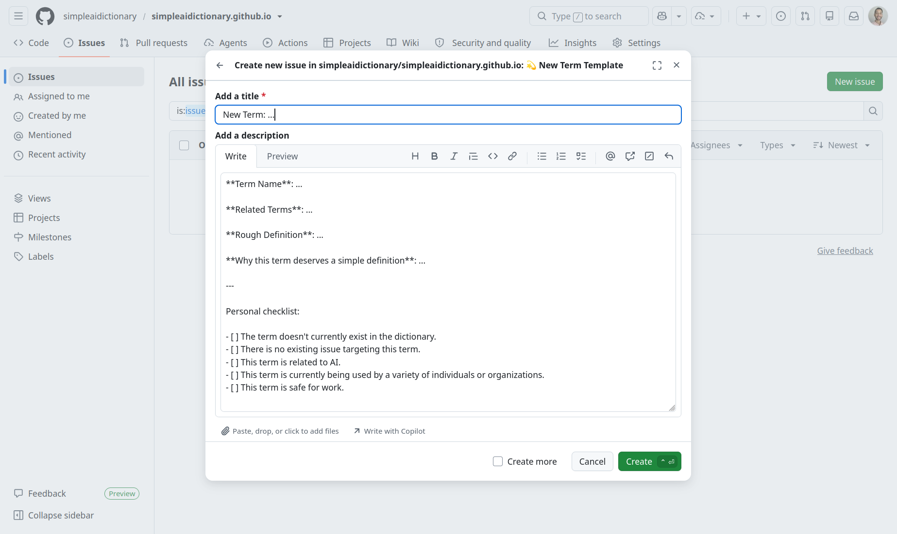

A simple dictionary that defines the AI buzzwords that've been buzzing you crazy!

## Why the Dictionary?

GenAI is a liminal space. It's changing rapidly. As a result, new terms are being added continiously.

### The Problem

Understanding new AI "buzzwords" is not always an easy task. Definitions can be too abstract and fail to describe how these terms are actually being used.

### The Solution

A simple, straightforwad, community-driven dictionary that puts a real definition to AI buzzwords.

Additionally, it provides 2 levels of definitions:

- A **general** definition suitable for everybody!
- A **software** definition suitable for software folks (and others familiar with the AI space).

---

## Contribute!

There's a variety of ways you can contribute to the dictionary!

### Word of the Day

If you want to suggest a word of the day, simply open up a pull request with an edit to: `lib/term_of_the_day.ts`!

### Add a New Term

If you want to add a new term to the dictionary, open up an issue using our handy, dandy `new term` template.

This template aims to take a low amount of effort upfront, in case the definition is not approved. If the definition is approved, you will then be asked for a general and software definition, accordingly.

This helps us open up the floor for discussion, before making a pull request.

Please view: [#28](https://github.com/simpleaidictionary/simpleaidictionary.github.io/issues/28), for an example of how this works!

### Other Stuff

Just open up an issue with any other suggestions!
